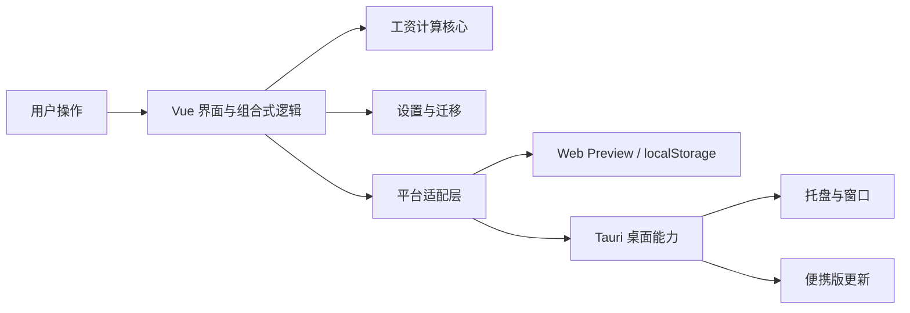

# PayDance 架构与修改导航

> [English version →](ARCHITECTURE_EN.md)

本文不是技术栈介绍，而是一张“想改什么，应去哪里”的导航图。

## 运行结构

- `src/lib/salary/`：纯工资计算，处理月薪、日薪、时薪、午休、夜班和工作日。
- `src/composables/`：把计算、设置、窗口和界面状态组合成应用行为。
- `src/components/`：桌面版与 Web Preview 共用的 Vue 界面。
- `src/platform/`：网页与 Tauri 的差异边界，禁止网页适配器引入 Tauri 模块。
- `src/web-preview/`：官网页面、浏览器状态和分区样式。
- `src-tauri/src/tray.rs`：托盘菜单、语言和托盘动作。
- `src-tauri/src/portable_update.rs`：Windows 便携版更新。
- `src-tauri/src/lib.rs`：只负责注册插件、命令和启动模块。

## 数据流

1. `useSalarySettings.ts` 从平台设置存储读取配置。
2. `settings-migration.ts` 归一化旧值或损坏值，只回退必要字段。
3. `useSalaryTicker.ts` 使用单调时钟驱动工资快照。
4. `src/lib/salary/` 计算今日收入、进度和下一次状态变化。
5. `useDashboardModel.ts` 把计算结果转换为界面文案。
6. 窗口模式、位置和透明度通过各自 composable 保存，不进入工资计算核心。

## 修改导航

| 想修改的内容 | 主要位置 | 至少运行 |
|---|---|---|
| 工资算法、午休、夜班 | `src/lib/salary/` | `npm test -- src/lib/salary` |
| 设置字段或兼容迁移 | `src/lib/settings-migration.ts`、`src/composables/useSalarySettings.ts` | `npm test -- settings` |
| 主窗口或设置界面 | `src/components/` | `npm test`、`npm run build:desktop` |
| 官网布局或样式 | `src/web-preview/` | `npm run build:web`、`npm run qa:web-preview` |
| 托盘或桌面窗口行为 | `src-tauri/src/tray.rs`、`src/composables/useWindowMode.ts` | `cargo test`、相关 Vitest |
| 自启动 | `src/lib/autostart.ts` | `npm test -- autostart` |
| 更新与发布 | `src-tauri/src/portable_update.rs`、`.github/workflows/release.yml` | `npm run verify:release` |
| 依赖更新 | `.github/renovate.json` | `npm run verify:metadata` |

## 重要边界

- 工资算法必须保持纯函数，不读取窗口、存储或 Tauri API。
- Web Preview 只能通过 `*.web.ts` 平台适配器访问浏览器能力。
- 新持久化字段必须先有迁移测试，不能让旧配置阻塞启动。
- CSS 分区由 `src/web-preview/web-preview.css` 按固定顺序导入，改顺序必须通过视觉差异检查。
- Rust 主入口不承载具体托盘或更新逻辑。
- 自动化不能可靠证明真实休眠、系统托盘点击和重启后自启动，这些仍需发版人工冒烟。
