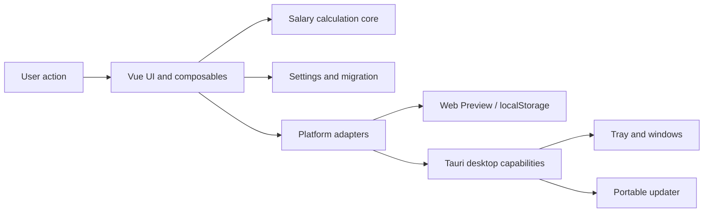

# PayDance Architecture and Change Map

> [中文版 →](ARCHITECTURE.md)

This is not a technology brochure. It is a map from a desired change to the code and checks that own it.

## Runtime Shape

- `src/lib/salary/`: pure salary calculation for monthly, daily, hourly, lunch, overnight, and workday rules.
- `src/composables/`: application behavior that combines calculation, settings, window state, and UI state.
- `src/components/`: Vue UI shared by desktop and Web Preview.
- `src/platform/`: the Web/Tauri boundary; Web adapters must not import Tauri modules.
- `src/web-preview/`: storefront page, browser state, and responsibility-based styles.
- `src-tauri/src/tray.rs`: tray menu, localization, and tray actions.
- `src-tauri/src/portable_update.rs`: Windows portable update flow.
- `src-tauri/src/lib.rs`: plugin, command, setup, and startup orchestration only.

## Data Flow

1. `useSalarySettings.ts` loads configuration from the platform settings store.
2. `settings-migration.ts` normalizes legacy or damaged values and resets only the necessary fields.
3. `useSalaryTicker.ts` drives salary snapshots with a monotonic wall clock.
4. `src/lib/salary/` calculates earnings, progress, and the next state transition.
5. `useDashboardModel.ts` turns calculation results into display text.
6. Window mode, position, and opacity persist through their own composables and never enter the salary core.

## Change Map

| Change | Primary ownership | Minimum checks |
|---|---|---|
| Salary rules, lunch, overnight shifts | `src/lib/salary/` | `npm test -- src/lib/salary` |
| Settings fields or migration | `src/lib/settings-migration.ts`, `src/composables/useSalarySettings.ts` | `npm test -- settings` |
| Main window or settings UI | `src/components/` | `npm test`, `npm run build:desktop` |
| Storefront layout or CSS | `src/web-preview/` | `npm run build:web`, `npm run qa:web-preview` |
| Tray or desktop window behavior | `src-tauri/src/tray.rs`, `src/composables/useWindowMode.ts` | `cargo test`, focused Vitest |
| Autostart | `src/lib/autostart.ts` | `npm test -- autostart` |
| Updates and releases | `src-tauri/src/portable_update.rs`, `.github/workflows/release.yml` | `npm run verify:release` |
| Dependency updates | `.github/renovate.json` | `npm run verify:metadata` |

## Important Boundaries

- Salary calculations stay pure and cannot read window, storage, or Tauri APIs.
- Web Preview accesses browser capabilities only through `*.web.ts` adapters.
- Every persisted field starts with a migration test; old settings must never block launch.
- `src/web-preview/web-preview.css` imports CSS sections in a fixed order; order changes require visual regression QA.
- The Rust entrypoint does not own tray or updater implementation details.
- Automation cannot reliably prove real sleep/resume, system-tray clicks, or post-reboot autostart. Release smoke testing still covers them manually.
